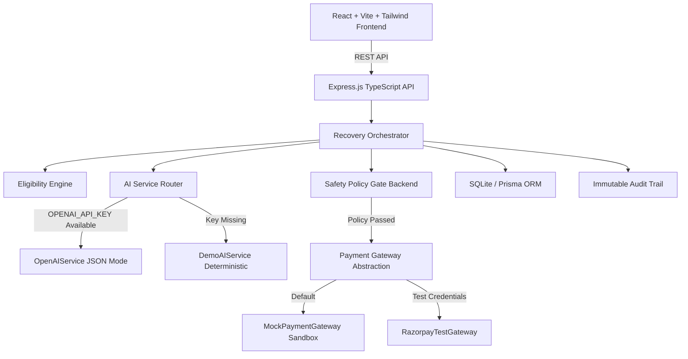

# RecoverAI — Autonomous AI Revenue Recovery Agent

> **Razorpay AI Buildathon 2026 Submission**  
> **Track 03:** AI Revenue Recovery  
> **Live Demo Mode:** Fully functional out-of-the-box without requiring external API credentials.

---

## 1. Project Overview
**RecoverAI** is an enterprise-grade AI revenue recovery platform designed specifically for Indian merchants, digital subscriptions, and SaaS businesses. It closes the loop from payment failure detection to root-cause diagnosis, contextual intervention selection, policy gate validation, sandbox payment retry execution, and immutable audit tracking.

---

## 2. Problem Statement
Payment failures present one of the largest silent revenue leaks for merchants:
- **Bank Gateway Timeouts & Latency**: Transient failures caused by inter-bank routing issues.
- **Card Declines & Expirations**: Customers with expired card details or insufficient funds during automated debits.
- **Authentication Timeouts (3D Secure / OTP)**: Customers abandoning checkout sessions due to SMS delay.
- **NPCI e-Mandate Failures**: Recurring auto-debit failures on UPI / NACH mandates.

Standard payment gateways mark these payments as `FAILED` and rely on passive merchant follow-ups.

---

## 3. Why Revenue Recovery Matters
Unrecovered payment failures lead to:
- High involuntary churn (up to 30-40% of churn is payment failure, not customer dissatisfaction).
- Lost customer lifetime value (LTV).
- High manual operational cost in customer success follow-ups.

---

## 4. The RecoverAI Solution
RecoverAI introduces an **Autonomous Agentic Recovery Loop**:
1. **Risk & Failure Diagnosis**: Evaluates historical customer success rates, payment attempt count, failure cause, and recency.
2. **AI Intervention Selection**: Recommends targeted, high-probability interventions (`schedule_retry`, `send_checkout_link`, `suggest_alternate_payment_method`, etc.).
3. **Safety Policy Gate**: Enforces deterministic, hardcoded rules in backend code to prevent unauthorized or excessive payment charges.
4. **Simulated Execution**: Executes retries or dispatches payment links via gateway abstractions.
5. **Audit Trail Logging**: Records every reasoning step and action to ensure 100% compliance.

---

## 5. Architecture Diagram



---

## 6. Allowed Actions
Only the following 7 actions are allowed by the backend policy gate:
- `retry_payment` (Max 2 attempts)
- `schedule_retry` (Max 2 attempts)
- `send_payment_reminder` (Max 3 communications)
- `suggest_alternate_payment_method` (Max 3 communications)
- `send_checkout_link` (Max 3 communications)
- `escalate_to_human` (Triggered on repeat failures or policy block)
- `stop_recovery` (Triggered on opt-out or recovery complete)

*Any other action proposed by AI is strictly rejected by the backend policy gate.*

---

## 7. Safety Model
Safety rules are enforced in **deterministic TypeScript backend code**, NEVER through AI prompts:
- **Max 2 Automated Retries**: Prevents card spamming or issuing bank blocking.
- **Max 3 Recovery Communications**: Protects customer experience against spam.
- **Stop on Recovery**: Halts workflow immediately upon payment collection.
- **Stop on Opt-Out**: Respects explicit customer communication preferences.
- **Human Escalation Threshold**: Automatically creates a support ticket when automated limits are reached.
- **Isolated Payment Execution**: Default mode uses `MockPaymentGateway` sandbox — real money is never charged.

---

## 8. Why AI vs Deterministic Rules?

| Component | Technology | Rationale |
| :--- | :--- | :--- |
| **Failure Diagnosis** | AI (`OpenAI` / `DemoAI`) | Unstructured context reasoning across failure causes, customer segments, and payment history. |
| **Intervention Selection** | AI (`OpenAI` / `DemoAI`) | Selecting optimal recovery channel and timing based on confidence scoring. |
| **Metrics & Aggregates** | Deterministic Code | Precise financial math (Revenue at Risk, Recovery Rate, Recovered Amount). |
| **Safety Policy Gate** | Deterministic Code | Strict governance limits cannot be left to probabilistic LLM outputs. |
| **Audit Logging** | Deterministic Code | Immutable database records for regulatory compliance. |

---

## 9. Tech Stack

- **Frontend**: React 18, TypeScript, Vite, Tailwind CSS, Recharts, Lucide Icons, Axios.
- **Backend**: Node.js, Express.js, TypeScript, Prisma ORM, SQLite.
- **AI Integration**: OpenAI API (Structured JSON output with Zod validation) + Fallback `DemoAIService`.
- **Payment Gateway**: Abstraction layer supporting `MockPaymentGateway` and `RazorpayTestGateway`.

---

## 10. Installation & Quick Start

### Prerequisites
- Node.js (v18+)
- npm

### 1. Backend Setup
```bash
cd backend
npm install
npx prisma migrate dev --name init
npm run seed
npm run dev
```
*Backend runs on `http://localhost:5000`*

### 2. Frontend Setup
In a separate terminal:
```bash
cd frontend
npm install
npm run dev
```
*Frontend runs on `http://localhost:3000`*

---

## 11. Environment Variables

### `backend/.env`
```env
PORT=5000
DATABASE_URL="file:./dev.db"
OPENAI_API_KEY=          # Optional: Omit to use built-in DemoAIService
RAZORPAY_KEY_ID=         # Optional: Omit to use built-in MockPaymentGateway
RAZORPAY_KEY_SECRET=     # Optional: Omit to use built-in MockPaymentGateway
NODE_ENV=development
```

---

## 12. API Documentation

- `GET /api/health` — System status and active AI/Gateway mode
- `GET /api/dashboard/metrics` — Dynamic financial aggregates & chart payloads
- `GET /api/transactions` — Search & paginated list of transactions
- `GET /api/transactions/:id` — Transaction detail with timeline & audit logs
- `POST /api/transactions/generate` — Re-seeds 105 synthetic transactions
- `POST /api/recovery/analyze/:id` — Triggers AI diagnosis for a transaction
- `POST /api/recovery/execute/:id` — Executes safety-gated recovery intervention
- `POST /api/recovery/simulate` — Runs batch simulation across all 105 transactions
- `POST /api/recovery/failure-demo` — Runs pitch failure scenario demo
- `GET /api/analytics` — Segment recovery metrics & simulation run logs
- `GET /api/audit-logs` — Filterable audit trail events
- `GET /api/safety-rules` — Active safety controls & policy rules

---

## 13. Pitch Demo Instructions

1. **Dashboard Overview**: Inspect dynamic KPI cards and Recharts visual breakdowns.
2. **Run Recovery Simulation**: Click "Run Recovery Simulation" on top bar or Recovery Agent page to watch 105 transactions process step-by-step with dynamic recovered volume calculations.
3. **Simulate Gateway Failure Demo**: Click "Simulate Gateway Failure" to test controlled failure handling (Timeout -> Retry -> Fail -> Safety Gate -> Escalate to Human -> Audit Logged).
4. **Inspect Transaction Detail**: Click any transaction to review the AI decision, "Why:" explanation callout, interactive timeline, and audit trail.
